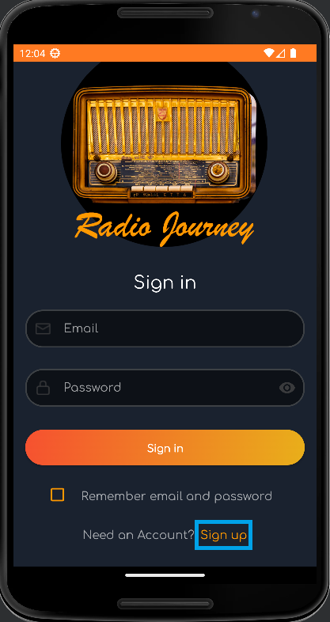
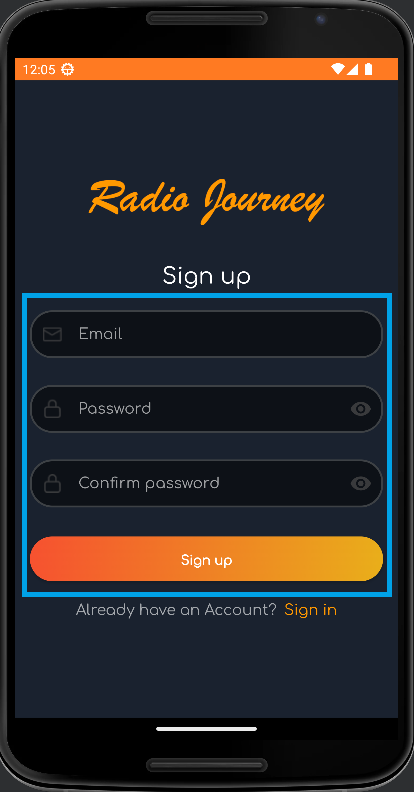
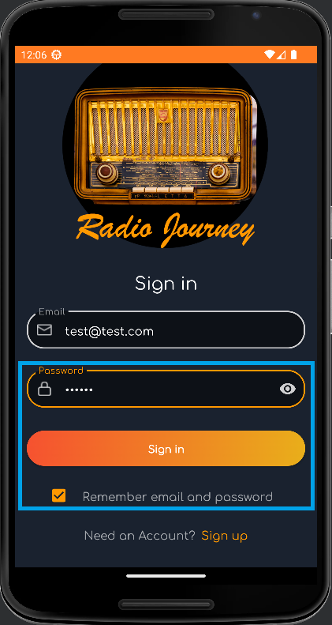
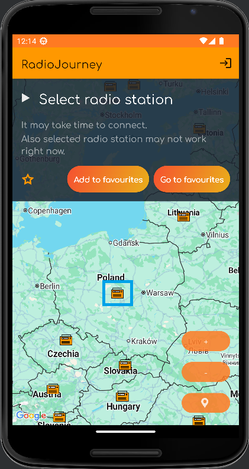
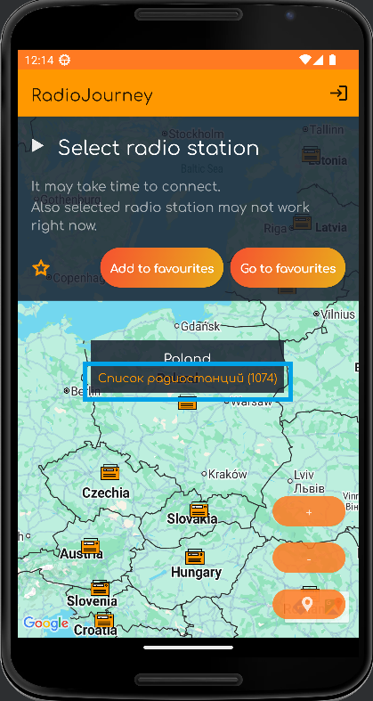
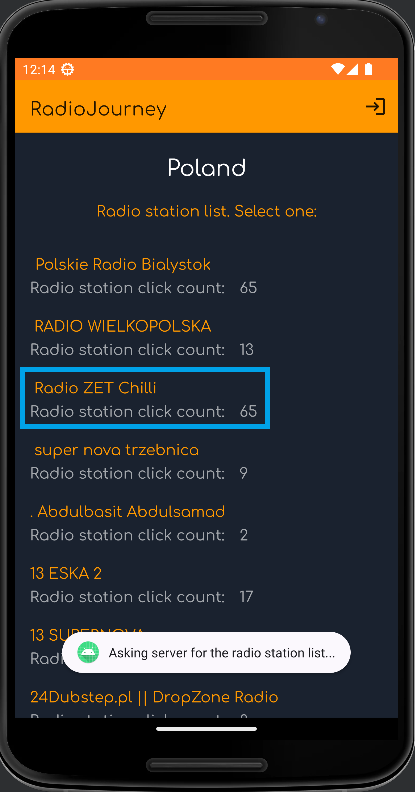
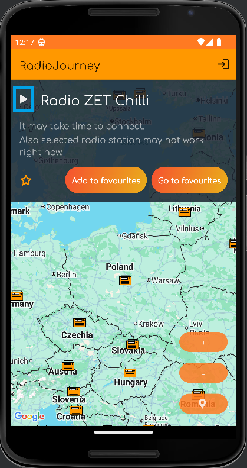
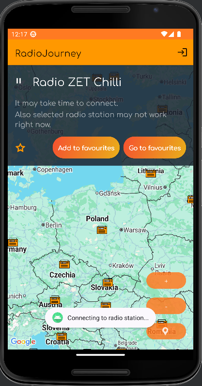

# TMS_GRADUATE_WORK
It is a repository for my graduate work. My graduate work is **an application for listening to Internet radio stations**.

**This source code is free for studying purposes but you are not allowed to copy and use it in other applications (projects).**

Created by Alina Piatrova.

## Content / Содержание
- [📱 About the application](#about-the-application)
- [🚀 How to use the application](#how-to-use-the-application)
- [🛠️ Tech stack](#tech-stack)
- [⚙️ Problems](#problems)
- [📱 О программе](#о-программе)
- [🚀 Как пользоваться программой](#как-пользоваться-программой)
- [🛠️ Технологический стек](#технологический-стек)
- [⚙️ Проблемы](#проблемы)

------------------

<a id="about-the-application"></a>
## 📱 About the application
This project is **an application for listening to Internet radio stations**.    

I am using **API.radio-browser.info** which allows you to access to collected internet radio stations from all over the world (https://www.radio-browser.info/). This API is available for free. The author allows to use it in free and commercial software without restrictions.

------------------

<a id="how-to-use-the-application"></a>
## 🚀 How to use the application
There are Sign up and Sign in screens with minimal checks of data entry. **User registration is done for practice purpose so the logged data is stored just in the Room database**

1. First of all **create an account**:  
<p align="center">  </p>  
<p align="center">  </p>

2. Than write your just saved **password**, click the **check box** and click **sign in button**:  
<p align="center">  </p>  

3. Before entering the application, you are asked for your **location permission**:  
<p align="center">  </p>

4. **On the main page** you will find a google map with **markers**, by clicking on which you can see the number of available Internet radio stations in this country.  
A list of Internet radio stations in the selected country (recycler view) **can be opened by clicking on this message** and then you can select the radio you are interested in:  
<p align="center">  </p>  
<p align="center">  </p>

5. Chose radio station from the list and **click on it**:
<p align="center">  </p>

6. By clicking on the radio, the user **returns to the main screen** and can listen to it if this radio is currently working.  
**Click on play button to connect to the radio station**:
<p align="center">  </p>  
<p align="center">  </p>

------------------

## 🛠️ Tech stack
- **Kotlin**
- **Gradle**
- **Hilt** (DI)
- **Navigation component**
- **View Binding**
- **Shared preferences** to store small key-value pairs (token for instance)
- **Room database** to store marker locations on the map, as well as to store favorite radio stations. You need to wait for the end of caching at the first start (further the data is taken from the subscription to the local database). User registration is done for practice, so the logged data is also stored in the Room
- **Foreground service** to display caching progress in notification
- **Coroutines** for all the requests to the server or to the local database from the ViewModel
- **Retrofit2** for the requests to the server
- **MVVM** architectural pattern
- **Clean Architecture** concept

------------------

## ⚙️ Problems
While using the native android geocoder function to get the location by address - `geocoder.getFromLocationName()`, quite often an exception **«grpc failed»** comes.
**I will quote** one of the comments on this matter from the site **stackoverflow.com**:  

```
It looks like this is ongoing issue that was reported in the Google issue tracker both for real devices and emulators. You can refer to the following bugs:  

https://issuetracker.google.com/issues/64418751  
https://issuetracker.google.com/issues/64247769

Unfortunately, Google haven't solved these issues yet.  
As a workaround you can consider using the Geocoding API web service. Please note that there is a Java client library for web services that you can find on Github:

https://github.com/googlemaps/google-maps-services-java

Using Java client library for web services you can implement reverse geocoding lookup that shouldn't give you the error that you experience with native Android geocoder.  
The Javadoc for client library is located at

https://googlemaps.github.io/google-maps-services-java/v0.2.5/javadoc/

I hope this helps!
```

In my project, **I didn't use the Geocoding API** at the moment, because **it's paid**.    

**If the first time you launch the program an error occurs during caching** you should close the program and all its notifications (if there are any). Then turn airplane mode on and off and then launch the application again.  

This only matters **the first time you launch the program**. With further use, the program will work even if an error occurs during caching.  

------------------

## 📱 О программе
Данный проект представляет собой **приложение для прослушивания интернет радиостанций**.  

Я использую **API.radio-browser.info**, который предоставляет доступ к собранным интернет-радиостанциям со всего мира (https://www.radio-browser.info/). Этот API доступен бесплатно. Автор разрешает его использовать в бесплатном и платном программном обеспечении без ограничений.

------------------

## 🚀 Как пользоваться программой
Перед входом в приложение для практики реализованы экраны Sign up и Sign in с минимальными проверками правильности ввода данных. **Регистрация пользователя сделана для примера, поэтому регистрируемые данные сохраняются только в Room**

1. Для начала **создайте аккаунт**:  
<p align="center">  </p>  
<p align="center">  </p>

2. Затем введите только что сохранённый **пароль**, поставьте **галочку** и **войдите** в приложение:  
<p align="center">  </p>  

3. Перед входом в приложение запрашивается разрешение на **доступ к местоположению**:
<p align="center">  </p>

4. **На главной странице** вы найдете google карту с **маркерами**, нажимая на которые можно увидеть количество доступных в этой стране интернет радиостанций.  
**Нажав на это сообщение, открывается список интернет радиостанций** в выбранной стране (recycler view), где можно выбрать интересующее радио:
<p align="center">  </p>  
<p align="center">  </p>

5. Выберите радиостанцию из списка и **нажмите на неё**:
<p align="center">  </p>

6. По клику на радио, пользователь **возвращается на главный экран** и может его прослушать, если это радио в данный момент работает.  
**Нажмите на кнопку для подключения к радиостанции**:
<p align="center">  </p>  
<p align="center">  </p>

------------------

## 🛠️ Технологический стек
- **Kotlin**
- **Gradle** 
- **Hilt** (DI)
- **Navigation component**
- **View Binding**
- **Shared preferences** для хранения небольших пар ключ-значение (например токен)
- **Room database** для сохранения локаций маркеров на карте, а также для хранения избранных радиостанций. При первом запуске нужно дождаться окончания кеширования (в дальнейшем данные берутся из подписки на локальную базу данных). Регистрация пользователя сделана для примера, поэтому регистрируемые данные так же сохраняются в Room
- **Foreground service** для отображения прогресса кеширования в уведомлении
- **Coroutines** для всех запросов на сервер, либо в локальную БД из ViewModel
- **Retrofit2** для запросов на сервер
- **MVVM** архитектурный паттерн
- **Clean Architecture** подход

------------------

## ⚙️ Проблемы
При использовании функции родного android геокодера для получения местоположения по адресу - `geocoder.getFromLocationName()`, довольно часто приходит исключение **«grpc failed»**.  
**Процитирую** один из комментариев по этому поводу с сайта **stackoverflow.com**:

```
It looks like this is ongoing issue that was reported in the Google issue tracker both for real devices and emulators. You can refer to the following bugs:

https://issuetracker.google.com/issues/64418751  
https://issuetracker.google.com/issues/64247769

Unfortunately, Google haven't solved these issues yet.  
As a workaround you can consider using the Geocoding API web service. Please note that there is a Java client library for web services that you can find on Github:

https://github.com/googlemaps/google-maps-services-java

Using Java client library for web services you can implement reverse geocoding lookup that shouldn't give you the error that you experience with native Android geocoder.  
The Javadoc for client library is located at

https://googlemaps.github.io/google-maps-services-java/v0.2.5/javadoc/

I hope this helps!
```

В своём проекте я **не использовала Geocoding API** на данный момент, т.к. **он платный**.  
**Если** при первом запуске программы **во время кэширования возникнет ошибка**, следует закрыть программу и все его уведомления (если они есть). Затем включить и выключить авиа режим, после чего запустить приложение снова.  

Это имеет значение **только при первом запуске программы**. При дальнейшем использовании программа будет работать даже если во время кеширования возникнет сбой.  

------------------

Copyright 2022, Piatrova Alina. All rights reserved.

